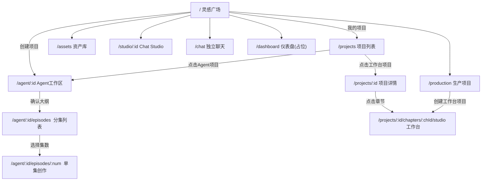

# AI Webtoon Studio — 前端 UI 全面分析报告

> **目标读者**：前端架构师 + UI/UX 设计师
> **技术栈**：Next.js 14 + TypeScript + TailwindCSS + Framer Motion + shadcn/ui
> **设计语言**：暗黑主题（OLED Black `#000000`），Emerald/Cyan 双色调，Fredoka（标题）+ Nunito（正文）

---

## 一、全局架构与布局体系

### 1.1 整体页面骨架 ([AppShell](file:///d:/ai-webtoon-studio/apps/web/src/components/app/AppShell.tsx#12-33))

```
┌──────────────────────────────────────────────┐
│  GlobalNav (左侧)  │       TopBar (顶部)     │
│  可折叠侧边栏       │  标题 + 设置/用户 按钮  │  ← 非Studio页面
│  72px / 240px       │  h-14, 可收起为 h-7     │
│                     ├─────────────────────────│
│  - 灵感广场 /       │                          │
│  - 我的项目         │      主内容区域           │
│  - 生产项目         │      overflow-auto        │
│  - 资产库           │      p-6                  │
│  - 生产队列         │                          │
│  - 设置             │                          │
└──────────────────────────────────────────────┘
```

- **Studio 页面**（路径含 `/studio`）跳过 [AppShell](file:///d:/ai-webtoon-studio/apps/web/src/components/app/AppShell.tsx#12-33)，使用独立全屏布局
- [GlobalNav](file:///d:/ai-webtoon-studio/apps/web/src/components/layout/GlobalNav.tsx#30-136) 使用 Framer Motion 动画折叠，宽度 72px ↔ 240px
- Logo: 渐变圆角方块（emerald → cyan），内含闪电图标

### 1.2 导航项（6个一级入口）

| 图标 | 标签 | 路由 | 说明 |
|------|------|------|------|
| ✨ Sparkles | 灵感广场 | `/` | 首页，创意输入 |
| 📁 Folder | 我的项目 | `/projects` | 项目列表（全部） |
| 🔨 Hammer | 生产项目 | `/production` | 仅工作台项目 |
| 🎨 Palette | 资产库 | `/assets` | 全局资产管理 |
| ⚡ Zap | 生产队列 | `/queue` | 占位，未实现 |
| ⚙ Settings | 设置 | `/settings` | 占位，未实现 |

### 1.3 设计系统（CSS 变量 / Design Tokens）

| Token | 值 | 用途 |
|-------|-----|------|
| `--color-background` | `#000000` | 页面背景 |
| `--color-primary` | `#18181B` | 表面/卡片 |
| `--color-secondary` | `#27272A` | 悬浮/边框 |
| `--color-text` | `#FAFAFA` | 主文字 |
| `--color-muted` | `#71717A` | 次要文字 |
| `--color-border` | `#3F3F46` | 边框 |
| `--color-accent-emerald` | `#10B981` | 主强调色 |
| `--color-accent-cyan` | `#06B6D4` | 辅强调色 |
| `--color-accent-violet` | `#8B5CF6` | 第三强调色 |
| `--color-accent-amber` | `#F59E0B` | 警告/高亮 |
| `--color-accent-rose` | `#F43F5E` | 危险/删除 |

**字体**：标题 `Fredoka` (font-heading)，正文 `Nunito` (font-body)

**预定义组件类**：`.btn-primary`、`.btn-secondary`、`.btn-accent`、`.card`、`.input`、`.glass`、`.gradient-border`、`.shimmer`、`.glow-emerald`、`.glow-cyan`

---

## 二、页面详细分析（共 11 个可访问页面）

---

### 2.1 首页 — 灵感广场 (`/`)

**文件**：[page.tsx](file:///d:/ai-webtoon-studio/apps/web/src/app/page.tsx)

**页面描述**：产品的核心入口，引导用户用自然语言描述创意想法，AI 自动生成漫剧。采用「中心化聚焦」布局。

**UI 元素清单**：

| 区域 | 元素 | 描述 |
|------|------|------|
| Hero 标题 | `<h1>` + 渐变文字 | "讲述你的**创意故事**"，渐变色 emerald→cyan→violet |
| 副标题 | `<p>` | "用自然语言描述你的想法，AI 帮你生成完整的漫剧" |
| 模板选择器 ([TemplateChips](file:///d:/ai-webtoon-studio/apps/web/src/components/home/TemplateChips.tsx#27-58)) | 6 个 pill 按钮 | 💕都市恋爱 / 🔍悬疑推理 / 🔥爽文逆袭 / ⚔️古风仙侠 / 🚀科幻未来 / 😄轻松搞笑 |
| 创意输入框 ([InspirationInput](file:///d:/ai-webtoon-studio/apps/web/src/components/home/InspirationInput.tsx#22-245)) | 大型 textarea + 工具栏 | 120px 高，支持附件上传、@提及、多剧集 toggle、"开始创作"按钮 |
| 快捷操作 | 2 个按钮 | "我的项目"（链接 `/projects`）+ "最近项目"（toggle） |
| 灵感广场 ([InspirationFeed](file:///d:/ai-webtoon-studio/apps/web/src/components/home/InspirationFeed.tsx#27-125)) | 4 个作品卡片 | 3:4 缩略图、标题、作者、浏览/点赞数、复刻按钮；目前为硬编码 demo 数据 |

**现存问题**：
- [InspirationFeed](file:///d:/ai-webtoon-studio/apps/web/src/components/home/InspirationFeed.tsx#27-125) 数据完全硬编码，无后端对接
- 附件上传功能 UI 完成但后端未实现
- @提及列表硬编码，非动态加载

---

### 2.2 Agent 工作区 (`/agent/[projectId]`)

**文件**：[page.tsx](file:///d:/ai-webtoon-studio/apps/web/src/app/agent/[projectId]/page.tsx)

**页面描述**：AI 对话式创作核心页面，用户与「导演 Agent」交互生成策划大纲。

**UI 元素清单**：

| 区域 | 元素 | 描述 |
|------|------|------|
| 聊天头部 | Agent 头像（渐变）+ "导演 Agent" + "在线"状态 | h-10，含"进入分集"按钮 |
| 消息区域 | 聊天气泡列表 | 用户消息（右侧，emerald 底色），Agent 消息（左侧，Markdown 渲染） |
| 动作卡片 [ActionCard](file:///d:/ai-webtoon-studio/apps/web/src/components/agent/AgentChat.tsx#15-29) | 嵌入聊天的交互卡片 | outline/script/storyboard/asset 四种类型，含"确认大纲"、"继续完善"按钮 |
| 输入区域 | textarea + @提及 + 发送按钮 | 支持 `@` 引用，Shift+Enter 换行 |
| 删除按钮 | hover 显示 | 每条消息 hover 时显示红色删除按钮 |
| 加载态 | Loader2 旋转 | "加载对话历史..." |
| 空状态 | Sparkles 动画图标 | "开始策划" + 引导文案 |
| 打字指示器 | 3 个弹跳圆点 | emerald / cyan 颜色交替动画 |

**交互流程**：
1. 从首页跳转时自动读取 sessionStorage 中的 prompt
2. 自动触发大纲生成 → 显示大纲卡片
3. 用户可确认大纲 → 跳转分集页，或继续完善
4. LLM 意图识别决定用户消息的处理方式

---

### 2.3 分集列表 (`/agent/[projectId]/episodes`)

**文件**：[page.tsx](file:///d:/ai-webtoon-studio/apps/web/src/app/agent/[projectId]/episodes/page.tsx)

**UI 元素清单**：

| 区域 | 元素 | 描述 |
|------|------|------|
| 返回链接 | `← 返回对话` | 文字链接 |
| 标题 | 项目名 + 描述文案 | "选择一集开始创作剧本" |
| 剧集网格 | Card 组件列表 | 1~3列响应式，每集一张卡片 |
| 剧集卡片 | Film 图标 + 标题 + 摘要 + Badge 状态 + 操作按钮 | 状态：待创作/编写中/已完成，按钮："开始创作"或"查看剧本" |
| 空/加载/错误状态 | 各自的 fallback UI | 标准 Loader2 动画 |

---

### 2.4 单集对话 (`/agent/[projectId]/episodes/[episodeNum]`)

**文件**：[page.tsx](file:///d:/ai-webtoon-studio/apps/web/src/app/agent/[projectId]/episodes/[episodeNum]/page.tsx)

**UI 元素清单**：

| 区域 | 元素 | 描述 |
|------|------|------|
| 顶部工具栏 | 返回箭头 + "第 N 集 脚本创作" + 重新生成按钮 + 导出按钮 | h=auto, border-b |
| 聊天区域 | 复用 [AgentChat](file:///d:/ai-webtoon-studio/apps/web/src/components/agent/AgentChat.tsx#127-359) 组件 | 自动触发脚本生成，支持用户追加指令 |
| 重新生成按钮 | violet 边框样式 | "重新生成脚本" / "生成中..." |
| 导出按钮 | outline 样式 | 脚本生成后显示，功能未完全实现 |

---

### 2.5 资产库 (`/assets`)

**文件**：[page.tsx](file:///d:/ai-webtoon-studio/apps/web/src/app/assets/page.tsx)（~1048 行，最大的单个页面文件）

**页面描述**：全局资产管理中心，管理人物、场景、物品、配音和音乐五类资产。

**UI 元素清单**：

| 区域 | 元素 | 描述 |
|------|------|------|
| 页头 | "资产库" + "新建资产"按钮 | emerald 渐变按钮 |
| Tab 切换栏 | 5 个标签页 | 👤人物 / 📍场景 / 📦物品 / 🎤配音 / 🎵音乐，含计数 Badge |
| 筛选区域 | 搜索框 + 项目选择下拉 | 搜索支持名称/描述/标签 |
| 资产卡片网格 | [AssetCard](file:///d:/ai-webtoon-studio/apps/web/src/app/assets/page.tsx#79-194) | 正方形缩略图 + 类型 Badge + 名称 + 描述 + 标签 + hover 菜单(编辑/重新生成/删除) |
| 配音卡片 | [VoiceAgentCard](file:///d:/ai-webtoon-studio/apps/web/src/app/assets/page.tsx#195-268) | Mic 图标 + 名称 + 音色ID + "默认" Badge |
| 音乐卡片 | [MusicCard](file:///d:/ai-webtoon-studio/apps/web/src/app/assets/page.tsx#269-370) | Music 图标 + 封面图 + 时长 + genre/mood 标签 |
| 创建弹窗 | [CreateAssetModal](file:///d:/ai-webtoon-studio/apps/web/src/app/assets/page.tsx#371-514) | 项目选择 + 类型选择(3列网格) + 名称输入 + 描述文本域 |
| 空状态 | [EmptyState](file:///d:/ai-webtoon-studio/apps/web/src/app/assets/page.tsx#515-545) | 大号类型图标 + "暂无XX资产" + 引导文案 |
| 配音详情弹窗 | Dialog | 音色 ID + 预览文本输入 + 播放/停止按钮 + 音频参数显示 |
| 音乐详情弹窗 | Dialog | 封面 + 名称 + 时长 + 标签 + 音频播放器 |

---

### 2.6 我的项目 (`/projects`)

**文件**：[page.tsx](file:///d:/ai-webtoon-studio/apps/web/src/app/projects/page.tsx)

**UI 元素清单**：

| 区域 | 元素 | 描述 |
|------|------|------|
| 页头 | "我的项目" + 总数 Badge | 渐变竖线装饰 |
| 模式筛选 | 分段按钮组 | 全部 / Agent / 工作台，含计数 |
| 工具栏 | 搜索框 + 视图切换(网格/列表) + 刷新 + "新建项目"按钮 | |
| 项目卡片 | [ProjectCard](file:///d:/ai-webtoon-studio/apps/web/src/app/production/page.tsx#18-94) | 渐变顶部线(Agent=emerald, 工作台=blue) + Film 图标 + 模式 Badge + 标题 + 章节数 + 更新时间 + hover 删除按钮 |
| 删除确认 | 自定义 Modal | 项目名高亮 + 警告文案 + 取消/确认删除 |
| 空状态 | Folder 图标 + 文案 | 区分搜索无结果/筛选无结果/无项目 |

---

### 2.7 生产项目 (`/production`)

**文件**：[page.tsx](file:///d:/ai-webtoon-studio/apps/web/src/app/production/page.tsx)

**页面描述**：仅展示「工作台模式」项目的入口 + 快捷操作。

**UI 元素清单**：

| 区域 | 元素 | 描述 |
|------|------|------|
| 页头 | "欢迎回来，创作者" + ✨动画图标 | 渐变竖线装饰 |
| 快捷操作 | 3 张 [ActionCard](file:///d:/ai-webtoon-studio/apps/web/src/components/agent/AgentChat.tsx#15-29) | 新建项目(emerald) / 快速教程(blue) / 模板库(amber)，含 hover 渐变背景 + 箭头 |
| 项目列表 | "我的项目" + 搜索/视图控件 | 仅 workbench 类型项目 |
| 创建弹窗 | Dialog | 项目名输入 + 创建按钮(emerald) |
| 背景 | 固定渐变 | emerald-950/20 → black → cyan-950/10 |

---

### 2.8 项目详情 (`/projects/[projectId]`)

**文件**：[page.tsx](file:///d:/ai-webtoon-studio/apps/web/src/app/projects/[projectId]/page.tsx)

**UI 元素清单**：

| 区域 | 元素 | 描述 |
|------|------|------|
| 顶部 | 返回按钮 + 面包屑 + 项目名 + "新建章节"按钮 | |
| 章节列表 | [ChapterListItem](file:///d:/ai-webtoon-studio/apps/web/src/app/projects/%5BprojectId%5D/page.tsx#155-224) | 章节图标 + 标题 + 描述 + 状态Badge(Draft/制作中/已完成) + Panel数 + 时间 + hover 箭头动画 |
| 空状态 | 渐变背景卡片 | Folder 图标 + "还没有章节" + "创建第一章"按钮 |
| 创建弹窗 | [CreateChapterModal](file:///d:/ai-webtoon-studio/apps/web/src/app/projects/%5BprojectId%5D/page.tsx#225-295) | 章节标题输入 + 取消/创建按钮 |

---

### 2.9 工作台 Studio (`/projects/[projectId]/chapters/[chapterId]/studio`)

**文件**：[StudioShell.tsx](file:///d:/ai-webtoon-studio/apps/web/src/components/studio/StudioShell.tsx) + [StudioLayout.tsx](file:///d:/ai-webtoon-studio/apps/web/src/components/studio/StudioLayout.tsx)

**页面描述**：全屏沉浸式漫画创作工作台，独立于 [AppShell](file:///d:/ai-webtoon-studio/apps/web/src/components/app/AppShell.tsx#12-33)，包含丰富的编辑功能。

**整体布局**：
```
┌───────────────────────────────────────────────────┐
│                 StudioTopbar                       │
│  返回按钮 + 面包屑 + 章节标题 + 操作按钮         │
├──────────┬────────────────────┬────────────────────┤
│ 左面板    │    中间画布区域     │    右面板           │
│ ScriptEd. │  StoryboardView   │  InspectorTabs     │
│ AssetBrow.│  PanelCard 列表   │  (Story/Cast/      │
│ NeedsFixL.│                    │   Layers/QA/       │
│ Settings  │                    │   Anchors/         │
│           │                    │   Consistency/     │
│           │                    │   Timeline/        │
│           │                    │   Analytics)       │
├──────────┴────────────────────┴────────────────────┤
│                TimelinePanel / JobsConsole          │
│              底部面板（可切换可折叠）                │
└───────────────────────────────────────────────────┘
```

**子组件清单（47个文件）**：

| 分组 | 组件 | 功能 |
|------|------|------|
| **顶部** | `StudioTopbar`, `ChapterActions` | 导航面包屑、保存/导出/一键生成按钮 |
| **左面板** | `ScriptEditor`, `AssetBrowser`, `NeedsFixList`, `StoryboardSettings` | 剧本编辑、资产浏览、问题修复列表、生成设置 |
| **中间** | `CanvasStage`, `StoryboardView`, `PanelCard` | 分镜画布、分镜列表视图、单格面板卡片 |
| **右面板** | `InspectorTabs` (8 个子 Tab) | Story/Cast/Layers/QA/Anchors/Consistency/Timeline/Analytics |
| **底部** | `TimelinePanel`, `TimelineDock`, `ClipRow`, `JobsConsole` | 时间轴、任务控制台 |
| **弹窗** | 11 个 Modal | 资产详情/批量渲染/打包预览/创建资产/草稿预览/导出/修复/导入/面板编辑/模板/... |
| **面板** | `AssetsLockPanel`, `CharacterEmbeddingPanel`, `SceneAnchorPanel`, `CanonicalStatusBadge` | 资产锁定、角色嵌入、场景锚点、状态标记 |
| **其他** | `TierSelector`, `VersionHistory`, `BatchRenderButton` | 质量等级选择、版本历史、批量渲染 |

---

### 2.10 Chat Studio (`/studio/[projectId]`)

**文件**：[ChatStudioShell.tsx](file:///d:/ai-webtoon-studio/apps/web/src/components/studio/ChatStudioShell.tsx)

**页面描述**：对话驱动的创作模式，左侧聊天 + 右侧画布，使用 `react-resizable-panels`。

**布局**：
```
┌──┬──────────────────┬──────────────────────────────┐
│  │   DirectorChat   │       CreativeCanvas          │
│侧│  对话面板 (32%)   │       画布面板 (68%)          │
│栏│  可伸缩 25~45%   │       分镜预览/编辑            │
│  │                   │                               │
│16│  聊天消息列表     │                               │
│px│  + 输入框         │                               │
└──┴──────────────────┴──────────────────────────────┘
```

**侧边栏导航**（独立于 GlobalNav）：首页 / 对话 / 图层 / 资产 / 历史 / 帮助 / 设置

---

### 2.11 其他页面

| 页面 | 路由 | 状态 |
|------|------|------|
| Dashboard | `/dashboard` | 占位页面，仅 3 个静态统计卡(Projects/Chapters/Panels=0) |
| Chat | `/chat` | 独立聊天模式，白色导航栏(与全局暗色不统一)，`ChatPanel` 组件 |

---

## 三、UI 组件库总览

### 3.1 基础 UI 组件（shadcn/ui，共 25 个）

`button` · `card` · `input` · `textarea` · `badge` · `dialog` · `dropdown-menu` · `tabs` · `select` · `label` · `checkbox` · `radio-group` · `switch` · `slider` · `progress` · `separator` · `scroll-area` · `sheet` · `skeleton` · `table` · `alert-dialog` · `toast` · `toaster` · `tooltip` · `MarkdownContent`

### 3.2 业务组件分类（18 个目录，119+ 文件）

| 目录 | 文件数 | 核心组件 | 功能 |
|------|--------|----------|------|
| `agent/` | 6 | AgentChat, PlanningPanel, AssetSlotPanel, EpisodeTree, AssetPicker, AssetLockGate | Agent 对话与资产管理 |
| `studio/` | 47 | StudioShell, StudioLayout, StudioTopbar + 各个子面板 | 工作台全部功能 |
| `home/` | 3 | InspirationInput, TemplateChips, InspirationFeed | 首页三大组件 |
| `chat/` | 5 | ChatPanel, ChatMessage, MessageInput, ActionCard | 独立聊天模式 |
| `canvas/` | 6 | StageView, StoryboardView, LayerPanel, BubbleEditor, ViewSwitcher | 画布/分镜视图 |
| `layer/` | 4 | LayerPanel, LayerSeparator, LayerViewer | 图层管理 |
| `bubble/` | 3 | BubbleEditor, BubbleRenderer | 对话气泡编辑 |
| `produce/` | 4 | FilmStrip, MaterialPanel, PreviewCanvas, Timeline | 成片制作 |
| `project/` | 1 | CreateProjectFlow | 项目创建流程 |
| `script-editor/` | 2 | ScriptInput | 剧本输入 |
| `asset-cards/` | 4 | CharacterCard, PropCard, SceneCard | 资产展示卡片 |
| `params-panel/` | 2 | ParamsPanel | 参数面板 |
| `continuity/` | 2 | ContinuityChecker | 连续性检查 |
| `analytics/` | 1 | CostDashboard | 成本分析 |
| `template/` | 1+ | 模板相关 | 模板管理 |
| `layout/` | 1 | GlobalNav | 全局导航 |
| [app/](file:///d:/ai-webtoon-studio/apps/web/src/components/studio/StudioShell.tsx#18-68) | 2 | AppShell, TopBar | 应用外壳 |
| `ui/` | 25 | shadcn/ui 基础组件 | 基础 UI |

---

## 四、关键设计问题与优化建议

### 4.1 设计一致性问题

| 问题 | 位置 | 描述 |
|------|------|------|
| ⚠️ Chat 页面风格不统一 | `/chat` | 白色 `bg-white` 导航栏，与全局暗色系完全冲突 |
| ⚠️ Dashboard 是占位页 | `/dashboard` | 纯静态，无实际功能，数据全部为 0 |
| ⚠️ 队列/设置页未实现 | `/queue`, `/settings` | 导航中有入口但页面不存在(404) |
| ⚠️ 两套导航系统 | [GlobalNav](file:///d:/ai-webtoon-studio/apps/web/src/components/layout/GlobalNav.tsx#30-136) vs [ChatStudioShell](file:///d:/ai-webtoon-studio/apps/web/src/components/studio/ChatStudioShell.tsx#14-130) 侧栏 | 逻辑和风格重复 |
| ⚠️ TopBar 功能单薄 | [TopBar.tsx](file:///d:/ai-webtoon-studio/apps/web/src/components/app/TopBar.tsx) | 仅"Webtoon Studio"标题 + 设置/用户图标，无实际功能 |

### 4.2 UI/UX 痛点

| 痛点 | 描述 |
|------|------|
| 没有用户系统 UI | 无登录/注册/头像/个人中心 |
| 缺少 Onboarding | 新用户无引导流程 |
| 数据硬编码 | InspirationFeed, @提及列表 均为 mock 数据 |
| 无响应式移动端适配 | 布局均以桌面端为主，移动端体验未知 |
| Studio 工作台复杂度高 | 47 个组件文件，但缺少统一的面板管理/快捷键/工作流引导 |
| 无全局通知/消息中心 | 仅有 Toast，缺少持久化通知 |
| 无暗/亮模式切换 | 仅暗色主题，无切换选项 |

### 4.3 动画与交互

- **已有**：Framer Motion 广泛使用（hover scale、入场动画、列表 stagger、气泡弹跳）
- **缺失**：页面切换无过渡动画、列表无虚拟滚动、拖拽排序未实现

---

## 五、路由地图



---

## 六、技术依赖清单

| 依赖 | 版本/说明 | 用途 |
|------|-----------|------|
| Next.js 14 | App Router | 框架 |
| TailwindCSS | 含自定义 config | 样式 |
| Framer Motion | 动画库 | 交互动画 |
| shadcn/ui | 25 个组件 | 基础 UI |
| Lucide React | 图标库 | 所有图标 |
| react-resizable-panels | 面板分割 | Chat Studio |
| Zustand | 状态管理 | studioStore |
| TanStack Query | 数据获取 | QueryProvider |
| Google Fonts | Fredoka + Nunito | 字体 |
| WebSocket | 自定义 client | 实时通信 |
